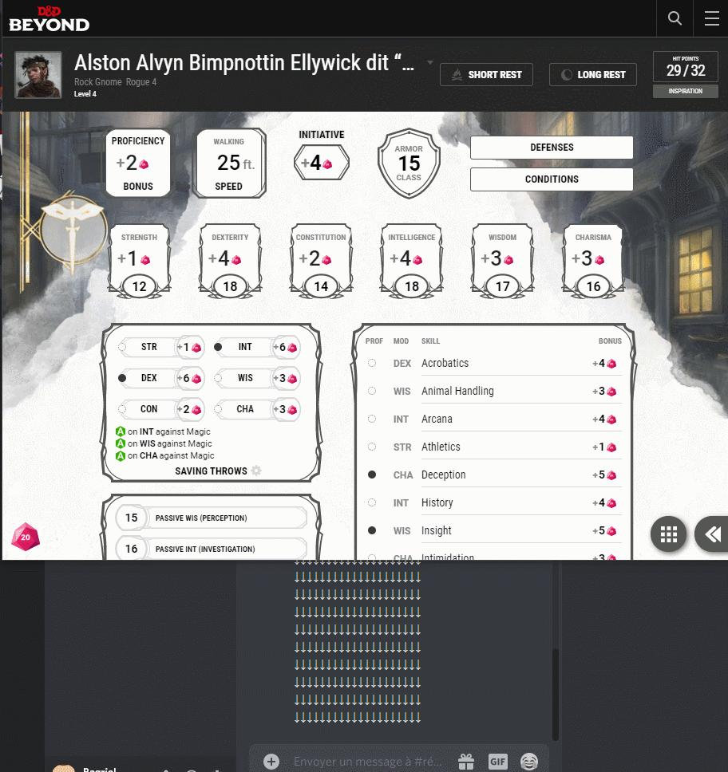

# discord-n-dice-beyond
Webextension that allow yout to roll dice (with dice parser) into your discord channel from your D&amp;D Beyond character sheet

#Présentation
Cette extension (Firefox pour le moment) à pour vocation de simplifier les lancées de dés pour les joueurs utilisant Discord et D&D Beyond.

Un D20 apparaitra en bas à gauche de la fiche de personnage (il faut être connecté à son compte). Au clique sur celui-ci, le lancé de dès se fera automatiquement sur le salon Discord correspondant.
Petit plus, le nom et l'avatar du personnage seront visible sur Discord.

Concernat le lancé de dés, il utilise DiceParser...
Si rien n'est configurer il se "lancé" sur le navigateur du joueur (pop-up).
Dans une prochaine version, DiceParser ne sera pas obligatoire.

#Configuration de Discord
Pour que l'extension fonctionne, elle a besoin d'un point d'entrée pour communiquer avec Discord.
Ce point d'entrée s'appelle un Webhook, il se matérialise par une simple URL.
Il ne doit être ajouté que dans le salon ou il y aura des lancés de dès.

Le mieux étant de suivre la procédure fournis par Discord : https://support.discordapp.com/hc/fr/articles/228383668-Utiliser-les-Webhooks

#Configuration de l'extension
Après installation de l'extension, un D20 est visible en haut à droite avec les autres extensions.
Il suffit d'enregistrer l'URL du webhook et tout est prêt pour jouer !

#A venir
J'ai plusieurs chantier en tête :
- Une version Chromium
- DiceParser non obligatoire
- Ajouter d'autres dès sur les compétences
- Avoir l'option de lancer un dés avec avantage/désavantage
- configuration de la couleur du dès affiché sur D&D Beyond
- un peu de style sur la fenêtre de configuration