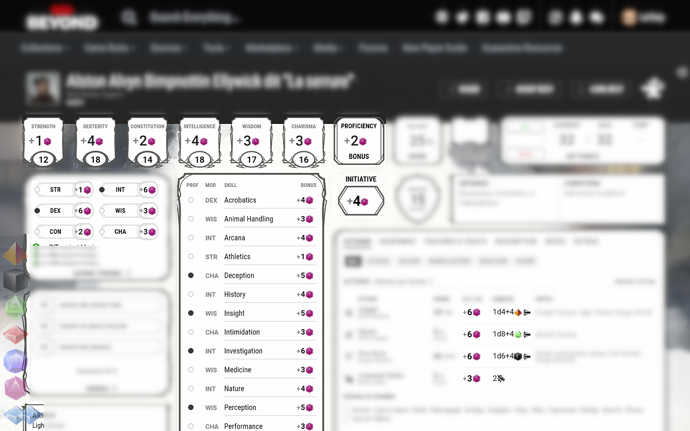

# Discord&Dice Beyond
Webextension that allow yout to roll dice (with dice parser) into your discord channel from your D&amp;D Beyond character sheet

# Présentation
Cette extension (Firefox et Chromium) à pour vocation de simplifier les lancés de dés pour les joueurs utilisant Discord et D&D Beyond.

Différent dés apparaissent en bas à gauche de la fiche de personnage (**il faut être connecté à son compte**). Au clique sur l'un de ces dés, un jet se fera automatiquement sur le salon Discord correspondant.
Il y a également un dés à côté de chaque compétence pour faire le jet en prenant en compte le modificateur.

Petit plus, le nom et l'avatar du personnage seront visible sur Discord.

Concernant le lancé de dé, il y a trois options :
- Sans Discord, affichage du résultat dans le navigateur
- Avec Discord avec DiceParser
- Avec Discord et DiceParser

# Configuration de Discord
Pour que l'extension fonctionne, elle a besoin d'un point d'entrée pour communiquer avec Discord.
Ce point d'entrée s'appelle un Webhook, il se matérialise par une simple URL.
Il ne doit être ajouté que dans le salon où il y aura des lancés de dés.

Le mieux étant de suivre la procédure fournis par Discord : https://support.discordapp.com/hc/fr/articles/228383668-Utiliser-les-Webhooks

# Configuration de l'extension
Après installation de l'extension, un D20 est visible en haut à droite avec les autres extensions.
Il suffit d'enregistrer l'URL du webhook et tout est prêt pour jouer !

# Un petit Gif sur la configuration de Discord et de l'extension

# A venir
J'ai plusieurs chantier en tête :
- nettoyer le code (dés de dommage/dés de repos) 
- gérer les changements d'onglet d'action (desktop)
- gérer l'ajout des dés lors de l'utilisation du menu de navigation rapide (mobile)
- recharger automatiquement l'onglet D&D Beyond lors du changement de configuration
- Avoir l'option de lancer un dés avec avantage/désavantage
- possibilité de lancer plusieur dés facilement
- améliorer l'affichage du résultat du jet de dés dans le navigateur
- ajouter un mode Discord sans Dice Parser et afficher le résultat dans le navigateur
