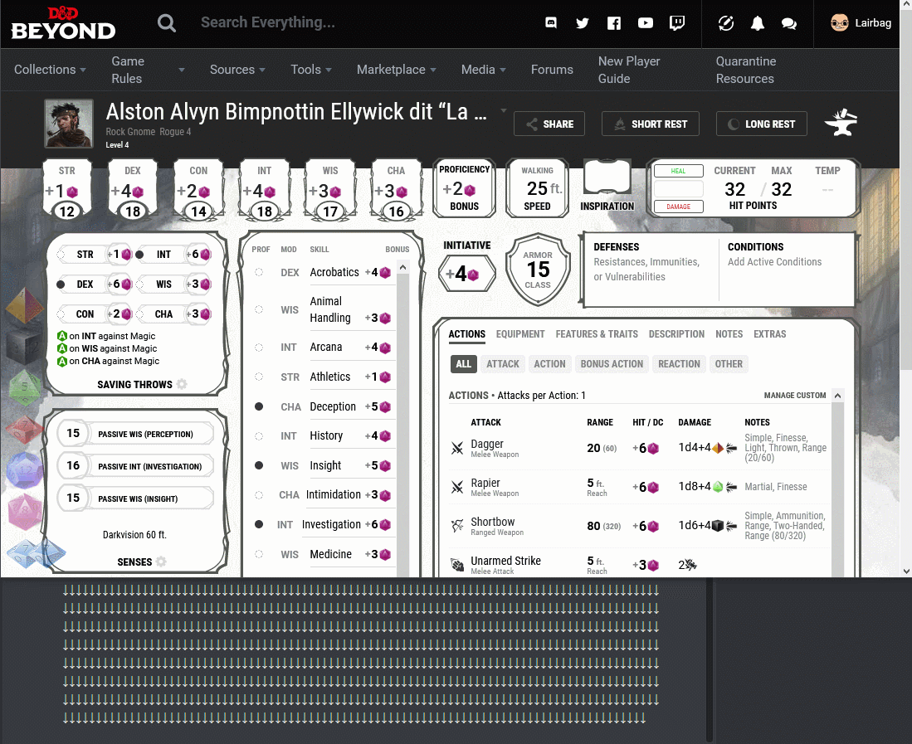

# Discord&Dice Beyond
Webextension that allow yout to roll dice (with dice parser) into your discord channel from your D&amp;D Beyond character sheet

# Présentation
Cette extension (Firefox et Chromium) à pour vocation de simplifier les lancés de dés pour les joueurs utilisant Discord et D&D Beyond.

Un D20 apparaîtra en bas à gauche de la fiche de personnage (**il faut être connecté à son compte**). Au clique sur celui-ci, le lancé de dé se fera automatiquement sur le salon Discord correspondant.
Petit plus, le nom et l'avatar du personnage seront visible sur Discord.

Concernant le lancé de dé : 
- Si Discord est configuré, il se fera avec le bot DiceParser (il faut donc qu'il soit installé sur le salon Discord).
*Dans une prochaine version, DiceParser ne sera pas obligatoire.*
- Sinon, le dé sera "lancé" sur le navigateur du joueur (ouverture d'une pop-up avec le résultat du jet).

# Configuration de Discord
Pour que l'extension fonctionne, elle a besoin d'un point d'entrée pour communiquer avec Discord.
Ce point d'entrée s'appelle un Webhook, il se matérialise par une simple URL.
Il ne doit être ajouté que dans le salon où il y aura des lancés de dés.

Le mieux étant de suivre la procédure fournis par Discord : https://support.discordapp.com/hc/fr/articles/228383668-Utiliser-les-Webhooks

# Configuration de l'extension
Après installation de l'extension, un D20 est visible en haut à droite avec les autres extensions.
Il suffit d'enregistrer l'URL du webhook et tout est prêt pour jouer !

# Un petit Gif sur la configuration de Discord et de l'extension

# A venir
J'ai plusieurs chantier en tête :
- DiceParser non obligatoire
- Avoir l'option de lancer un dés avec avantage/désavantage
- configuration de la couleur du dés affiché sur D&D Beyond
- un peu de style sur la fenêtre de configuration
- possibilité de lancer plusieur dés facilement
- possibilité de lancer d'autres type de dés
